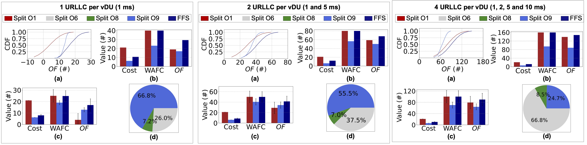
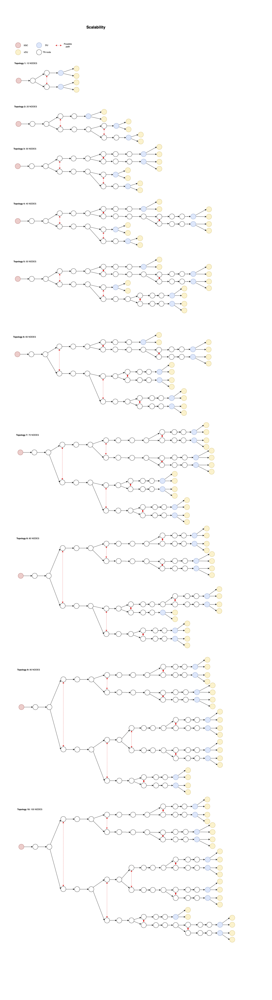
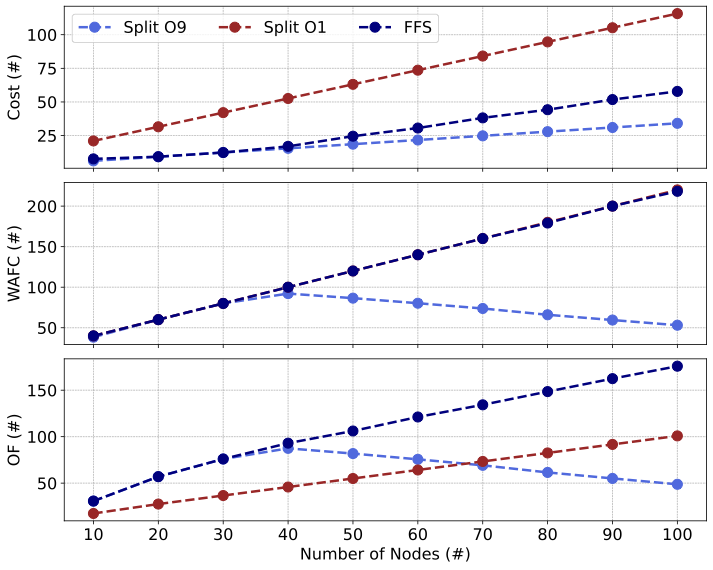

# Optimal Resource Allocation with Delay Guarantees for Network Slicing in Disaggregated RAN

This repository contains additional data from the paper "**Optimal Resource Allocation with Delay Guarantees for Network Slicing in Disaggregated RAN**" under review in IEEE/ACM Transactions on Networking. The data from the experiments, the implementation of the optimization model, the simulation parameters and the results obtained are publicly accessible in this repository.

---

## 📖 Introduction  
This repository contains the code and experiments related to the article *"Optimal Resource Allocation with Delay Guarantees for Network Slicing in Disaggregated RAN"*.  

The work proposes an optimization-based formulation that jointly considers:  

- **VNF (Virtualized Network Function) placement** at RAN nodes (RU, DU, CU).  
- **Resource allocation in the Transport Network (TN)** across network slices.  
- **End-to-end delay guarantees** for URLLC (Ultra-Reliable Low-Latency Communications) use cases in Industry 4.0 scenarios.  

The formulation integrates **Network Calculus** to compute deterministic delay bounds, exploring the **Flexible Functional Split (FFS)** paradigm while addressing the trade-off between:  
- Maximizing the number of flows that meet SLA requirements.  
- Minimizing deployment and operational costs of the disaggregated RAN.  

---

## 📊 Key Results  

### 🔹 Latency vs Cost Trade-off  
- Different functional splits exhibit clear trade-offs:  
  - **Split O1 (D-RAN)** supports up to 72 UEs but incurs higher costs.  
  - **Split O9 (C-RAN)** has lower costs but supports only 9 UEs under the 1 ms SLA.  
- **FFS** provides flexibility by dynamically adjusting VNF placement to balance cost and performance.  

### 🔹 Simplified Instance (2 URLLC NSIs)  
- Comparison among **CPLEX (optimal)**, **Reinforcement Learning (DDPG)**, and **Surrogate Model**.  
- All methods identified **Split O6** as the best option, but RL and Surrogate failed to reach the optimal rate allocation.  
- CPLEX admitted **118 UEs** (100 in one slice + 18 in another), while RL reached only 101 UEs.  

### 🔹 Parameter Variation (ζ and η)  
- **ζ (break-even point)**: larger values increase DU-related costs, pushing VNF centralization to the CU.  
- **η (CU/DU cost ratio)**: higher CU costs reduce the attractiveness of centralization.  
- Across all cases, the objective function remained positive, showing feasible and UE-oriented solutions.  

### 🔹 Scalability  
- In larger topologies (up to 60 nodes), **FFS consistently outperformed** fixed options (D-RAN and C-RAN).  
- For topologies up to 100 nodes, C-RAN outperformed D-RAN, but **FFS remained the most efficient strategy**.  

---

## 📌 Figures  

### Figure 5 – Main Results (Cost, WAFC, OF)  
  

### Figure 9 – Scalability (Cost, WAFC, OF)  
  

### Topology Example – Simulated Scenarios  
  

> Replace the images in `/img` with the ones generated from your experiments.  

---

## ⚙️ Tools Used  
- **IBM CPLEX**: to solve the optimization problem.  
- **DiscoDNC**: to calculate delay bounds via Network Calculus.  
- **OMNeT++/INET**: event-driven network simulations.  

---

## 🚀 How to Reproduce  
- The code and scripts to reproduce the experiments are included in this repository.  
- See the `/src` folder for examples of topology setup and simulation parameters.  
- Key results from Section IV of the article can be replicated by configuring the experiments accordingly.  

---


## How to cite
```
@misc{rocha2023optimal,
      title={Optimal Resource Allocation with Delay Guarantees for Network Slicing in Disaggregated RAN}, 
      author={Flávio G. C. Rocha and Gabriel M. F. de Almeida and Kleber V. Cardoso and Cristiano B. Both and José F. de Rezende},
      year={2023},
      eprint={2305.17321},
      archivePrefix={arXiv},
      primaryClass={cs.NI}
}
```
